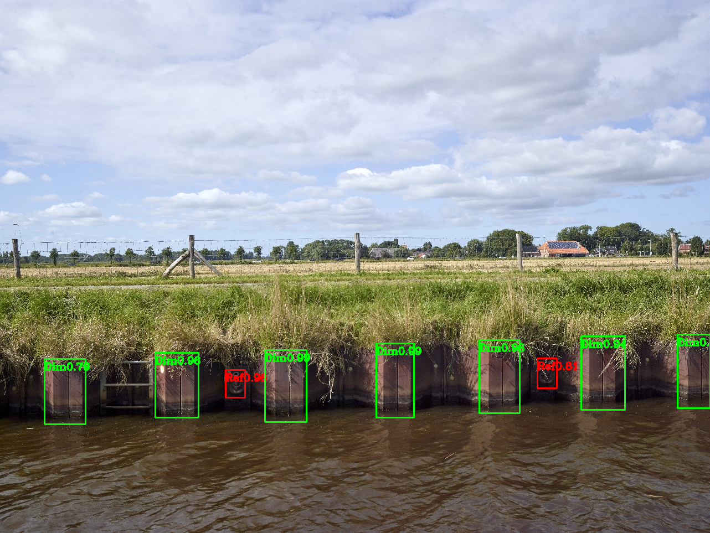

# Piling-sheet-assesment-
## Introduction
Asessing the corrosion on piling sheet according to NEN and estimating distance between the bumps. Two classificiation algorithm have been made:
1. Classification with four classes: Grass, Metal good, Metal bad and Rock.
2. Classification with six classes: Grass, Metal good, Metal acceptable, Metal moderate and Metal bad and Rock.

These classes for corrosion were based on [Digigids](https://digigids.hetwaterschapshuis.nl/index.php?p=gallery). Grass and rock were included as there was a large amount of it in the raw data-set.

After the assesment the images that have been labeled with "Metal" will be sent through an Object detection algorithm that was made using YOLOv4. This algorithm was trained to detect: the **bumps** of a piling sheet and a **reference** object. The reference object was something that was seen on most piling sheet in which we know the actual dimension. The horizontal distance between the bumps was calculated and using the reference object we converted the pixel distance into actual distance.

## Data
The data is part of a raw data-set from Witteveen+Bos N.V. and was remade to be used for image classification and object detection. It consists of high resolution images of a water channel between Lemmer and Delfzijl in The Netherlands. This water channel is going to be wider and deeper so a larger class of ships can pass through. The classification data-sets were made with the help of experts from Witteveen+Bos N.V. and the object detection data-set was made after they made clear which geometric information should be extracted from images.

Data can be downloaded from [4TU.ResearchData](https://doi.org/10.4121/21387930.v1) or [Kaggle](https://www.kaggle.com/datasets/richiemaskam/piling-sheet-data-2022). The classification images are already stored in different folders representing the classes. The data in Kaggle and 4TU.ResearchData has been adjusted for privacy concerns. In general the four class data-set has around 600 images per class and the six class data-set has around 300 images per class. The class "Metal bad", in the six class data-set, has around 150 images and more was not available. The object detection data contains the annotation files. The annotation file were created with [LabelImg](https://github.com/heartexlabs/labelImg). There is a seperate "Model Test" data in which inference was done. The model test set contains 100 images that has all the classes, but are all stored in a folder to simulate unlabeled images in a folder.

## Inference
If you just want to do inference you can use the keras and weights file. The keras file for the four class model is in this repository. The keras file for the six class classifier can be downloaded [here](https://drive.google.com/file/d/13Up7yLDlxNOzzBImQ9OVIjMZoIFR7lWv/view?usp=sharing). For object detection use the cfg file in this repository. Use this [link](https://drive.google.com/file/d/1--RfLsdJXUGPl9EcDlTDAd57qcZDjXKt/view?usp=sharing) to download the weights.
